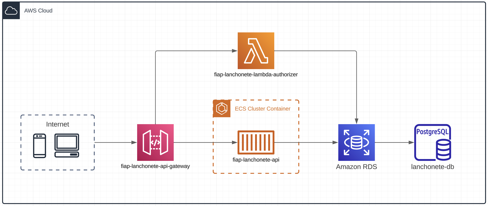

# fiap-lanchonete-terraform


[](https://www.terraform.io/)

## 📄 Descrição

Este projeto serve para gerenciar e provisionar a infra de cloud do projeto lanchonete através do terraform.



Os seguintes repositórios também fazem parte desse projeto:

> [fiap-lanchonete-api](https://github.com/MarcosPrata/fiap-lanchonete-api) - API core responsável por registrar e acompanhar pedidos e usuários.

> [fiap-lanchonete-api-gateway](https://github.com/MarcosPrata/fiap-lanchonete-api-gateway) - Responsável por intermediar as requests dos usuários e enviá-las ao serviço core, utilizando o lambda-authorizer como fator de authenticação.

> [fiap-lanchonete-lambda-authorizer](https://github.com/MarcosPrata/fiap-lanchonete-lambda-authorizer) - Reponsável por autenticar e autorizar as chamadas requests dos usuários.

## 🚀 Quick Start

Siga o passo a passo abaixo para provisionar os recursos na sua conta aws:

- Instalar e configurar o [Terraform](https://developer.hashicorp.com/terraform/tutorials/aws-get-started/install-cli) na sua máquina.

1. Baixando as dependencias

    ``` bash
    terraform init
    ```

2. Executando:

    > Observação: Nas etapas abaixo, haverá inputs onde você deve inserir credenciais da aws com poderes suficientes para criar os recursos desse projeto.

    2.1 Planejando a execução

    ``` bash
    terraform plan
    ```

    2.2 Aplicando alterações

    ``` bash
    terraform apply
    ```

✨ Prontinho a infra está toda criada na sua conta AWS

## 🎓 Integrantes / Devs

> Nome: Marcos Henrique Prata Junior 
> 
> Matrícula: RM349949
> 
> [](https://www.linkedin.com/in/marcos-henrique-prata-junior/)
> [](https://github.com/MarcosPrata)

> Nome: Marcos Moreira
>
> Matrícula: RM349544
>
> [](https://www.linkedin.com/in/moreira-dev/)
> [](https://github.com/MarcosPotato)


> Nome: Marcelo Gonçalves de Barros
>
> Matrícula: RM349535
>
> []()
> []()


> Nome: Henrique de Paula Leite
>
> Matrícula: RM350046
>
> []()
> []()
